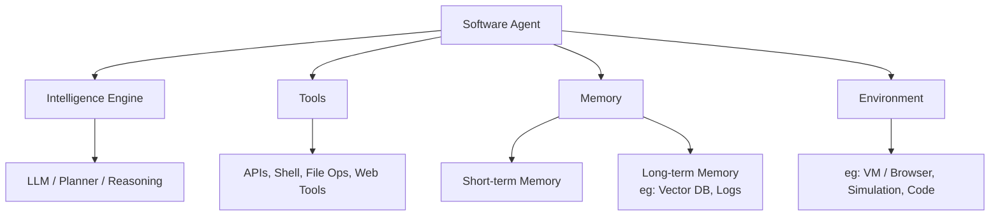

```mermaid
graph TD
    A[Software Agent] --> B[Intelligence Engine]
    A --> C[Tools]
    A --> D[Memory]
    A --> E[Environment]

    B --> B1[LLM / Planner / Reasoning]
    C --> C1[APIs, Shell, File Ops, Web Tools]
    D --> D1[Short-term Memory]
    D --> D2[Long-term Memory 
    eg: Vector DB, Logs]
    E --> E1[ eg: VM / Browser, Simulation, Code]
```