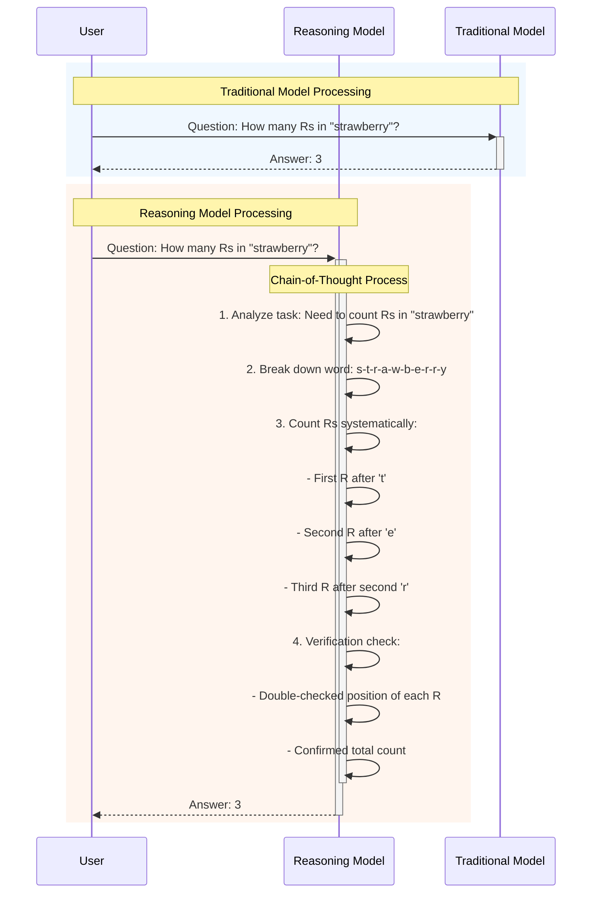

#### Rs in Strawberry Problem - diagram code



#### Reasoning models challenges - LaTex

```latex
\documentclass{article}
\usepackage[usenames,dvipsnames]{xcolor}
\begin{document}

\section*{Reasoning models challenges}
\begingroup
\setlength{\tabcolsep}{10pt} % Default value: 6pt
\renewcommand{\arraystretch}{2.5} % Default value: 1
\begin{tabular}{| l |l |}\hline
\textbf{Cost and Latency} & More steps = higher token usage and slower inference \\\hline
\textbf{Error Propagation} & One bad step early can derail the whole chain \\\hline
\textbf{Modularity Trade-offs} & Splitting planning/execution helps reasoning but reduces fluency \\\hline
\textbf{Evaluation Difficulty} & No single metric captures quality of reasoning well \\ \hline
\end{tabular}
\endgroup
\end{document}

```

#### Comparison of LLM Types by Reasoning Style - LaTex
```latex
\documentclass{article}
\usepackage{graphicx}
\usepackage[margin=1in]{geometry}
\usepackage{booktabs}
\usepackage{amssymb}

\begin{document}

\section*{Comparison of LLM Types by Reasoning Style}

\begin{tabular}{@{}p{4cm}p{4cm}p{4cm}p{4cm}@{}}
\toprule
\textbf{Feature} &
\textbf{Standard LLMs} &
\textbf{Implicit LRMs} &
\textbf{Explicit LRMs} \\
\midrule
\textbf{Reasoning Type} &
None &
Reasoning but internal &
Visible reasoning \\

\textbf{Step-by-step Output} &
No &
No &
Yes \\

\textbf{Output Behavior} &
Pattern-matching &
Smart, but not explainable &
Shows how it solves \\

\textbf{Examples} &
GPT-2, Mistral-7B, BERT &
GPT-4 (no CoT prompting) &
GPT-4 with CoT, ReAct, ToT \\

\textbf{Tool Use / Modularity} &
No &
Usually not &
Combines tools, memory, search \\

\textbf{Transparency} &
Black box &
Black box with smarter guesses &
White box (or closer to it) \\
\bottomrule
\end{tabular}

\end{document}

```